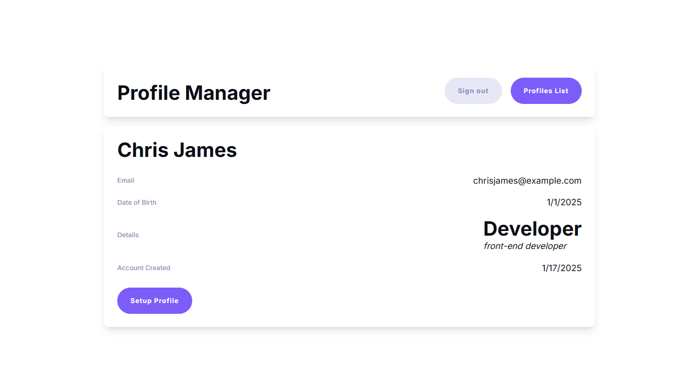

# Profile Management Web Application

This project is a web application built to manage user profiles using Prisma ORM. The application allows CRUD operations on user profiles through client-side interaction.

## Table of Contents

- [Overview](#overview)
  - [The Challenge](#the-challenge)
  - [Screenshot](#screenshot)
- [My Process](#my-process)
  - [Built With](#built-with)
- [Deployment](#deployment)
- [Author](#author)

## Overview

### The Challenge

The goal of this project is to demonstrate proficiency in creating a web application using Next.js and Prisma ORM to manage user profiles, utilizing Prisma as the ORM for database operations. The application includes the following features:

- **User Profiles Management:**
  - Create, Read, Update, and Delete (CRUD) operations for user profiles.
  - Manage user attributes including:
    - Name
    - Surname
    - Date of Birth
    - Profile Photo
    - Detailed Profile Description using a Rich Text Editor

- **Authentication and Authorization:**
  - User login functionality.
  - Registration of new users.
  - Full CRUD access to profiles for authenticated users.

### Screenshot

## My Process

### Built With

- [Next.js](https://nextjs.org/) - React Framework
- [React](https://reactjs.org/) - JavaScript Library
- [TypeScript](https://www.typescriptlang.org/) - Typed JavaScript
- [Prisma ORM](https://www.prisma.io/) - Database Toolkit
- [Tailwind CSS](https://tailwindcss.com/) - Utility-first CSS Framework
- [React Hook Form](https://react-hook-form.com/) - Form Library
- [Tiptap](https://tiptap.dev/) - Rich Text Editor
- [Zod](https://zod.dev/) - TypeScript-first Schema Validation
- [bcryptjs](https://github.com/dcodeIO/bcrypt.js) - Password Hashing
- [jsonwebtoken](https://github.com/auth0/node-jsonwebtoken) - JWT for Authentication
- [ESLint](https://eslint.org/) - Linting Tool
- [Prettier](https://prettier.io/) - Code Formatter

## Deployment

The project is deployed on [Vercel](https://profile-manager-dbuh77ng2-vcelakmareks-projects.vercel.app).

To run the project locally, follow these steps:

1. Clone the repository.
2. Install dependencies with `npm install`.
3. Create a `.env` file in the root directory and provide the `DATABASE_URL` and `SHADOW_DATABASE_URL` connection strings. Refer to the [Prisma documentation](https://www.prisma.io/docs/) for more details.
4. Run `npx prisma generate` to generate the Prisma client
5. Run `npx prisma migrate dev` to apply the migrations.
6. Run the development server with `npm run dev`.
7. Open `http://localhost:3000/` in your browser to view the application.

## Author

- GitHub - [Marek Vcelak](https://github.com/VcelakMarek)
- LinkedIn - [Marek Vcelak](https://www.linkedin.com/in/marek-v%C4%8Del%C3%A1k-6176bb1b0/)
